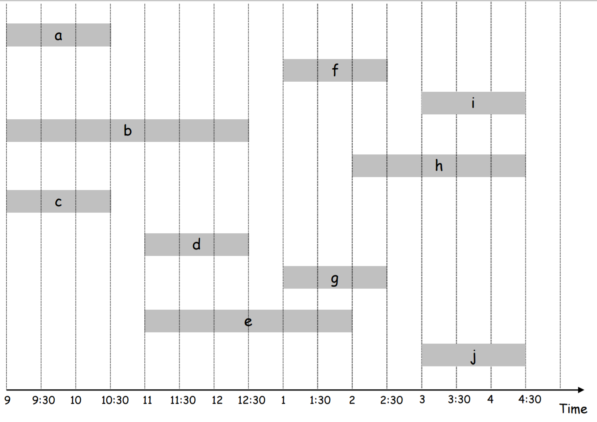
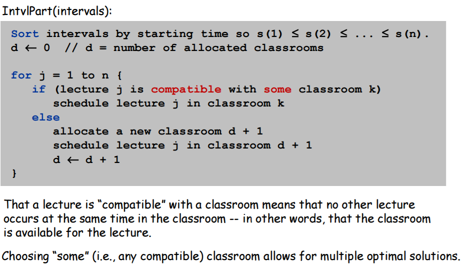
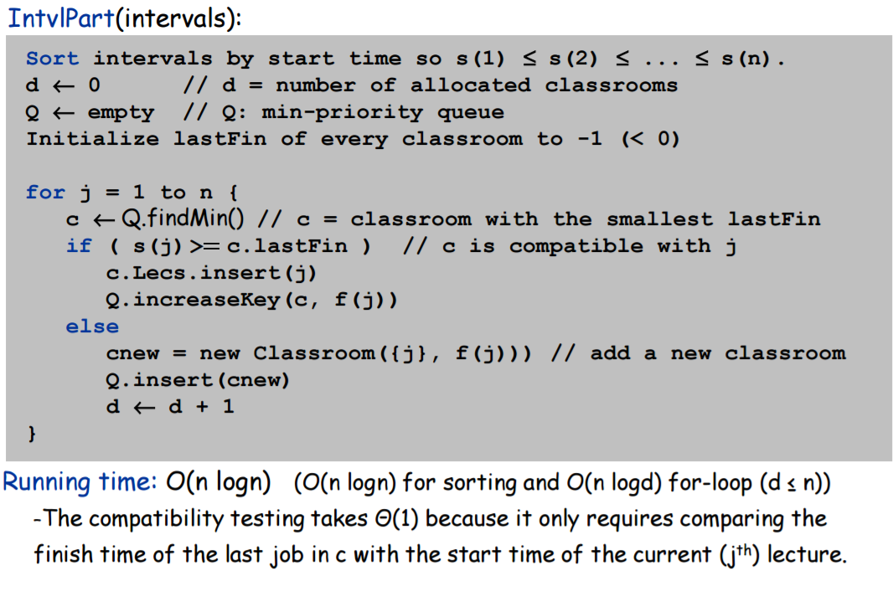

# Java Interval Partitioning Greedy Algorithm
Java Implementation of the Interval Partitioning greedy algorithm  
**Given a set of lectures (jobs) with start & end times, schedule all lectures to use the fewest rooms (resources)**

## Usage
- Times are treated as integers, but converted to strings when printing output (`getTimeFromInt()` method of `Lecture` class)
- Times are integers. 3-digits for the morning (9AM = 900), 4-digits for afternoons (10:30 = 1030)
- Uses 24-hour clock (2:30 PM is 14:30)
- &nbsp;
- Enter the Lectures/Jobs in `IntvlPart` constructor  
Sorted by start time later, **can be in any order**
- Run the program to view optimal schedule
- **Multiple optimal solutions may be found** depending on the order lectures were added in the constructor

### Output
1. Prints the room where a lecture is schedued when it is scheduled
2. A List of all the rooms and the lectures in that room
3. Output is printed to the screen as well as written to a file `output.txt`

## Example Lectures (Created in Constructor)  

## Pseudocode

## Pseudocode (detailed with runtime)

## Code Details / Notes
